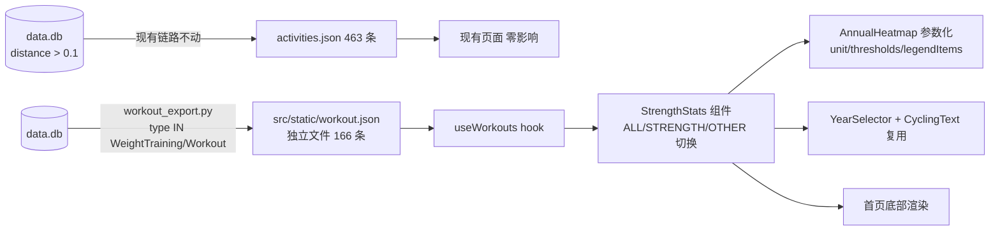

## 用户需求
在 running_page 首页底部新增一个“力量训练”统计模块，复用现有 "YEARLY HEATMAP" 跑步卡片的设计语言（暗黑卡片 + 渐变斜体标题 + 大数字统计 + 年度热力图 + 年份切换器）。

## 已确认决策
1. **数据范围**：WeightTraining（145 条）+ Workout（21 条）全部纳入（约 166 条，乒乓球等混入已接受）
2. **模块位置**：首页底部（ActivityStats 之后），不干扰现有跑步内容主次层级
3. **数据层独立**：新建独立的 `workout.json` 数据文件，**不改动 activities.json**（保持 463 条不变，现有页面零影响）
4. **热力图**：命名为 **WORKOUT HEATMAP**，支持**按类型查看**（类型切换）

## 核心功能
- **数据层**：新建 `workout_export.py` 导出脚本，从 data.db 提取 WeightTraining/Workout 全量数据到 `src/static/workout.json`
- **类型切换**：卡片内 ALL / STRENGTH（WeightTraining）/ OTHER（Workout）三态切换，热力图与统计数字联动
- **年度热力图**：按日聚合的训练次数热力图，图例与 tooltip 语义为“次”，主题色 violet/purple
- **统计指标**（随类型切换联动）：训练次数（TOTAL SESSIONS）、总时长（TOTAL TIME）、总卡路里（TOTAL CALORIES）、平均心率（AVG HEART RATE）
- **年份切换**：复用 YearSelector（2026/2025/2024）


## 技术栈
复用现有项目栈：React 18 + TypeScript + Tailwind CSS（暗黑主题），SQLAlchemy + SQLite 数据导出，pnpm 构建。不引入新依赖。

## 实现方案

### 1. 数据层：独立 workout.json（零侵入 activities.json）
新建 `run_page/workout_export.py` 导出脚本：
```python
# 核心查询（复用 generator.db.init_db，跳过 laps/streams 关联——力量训练均无此数据）
query = session.query(Activity).filter(Activity.type.in_(["WeightTraining", "Workout"]))
```
- `config.py` 新增 `WORKOUT_JSON_FILE = os.path.join(parent, "src", "static", "workout.json")`
- 导出字段与 `Activity.to_dict()` 一致（run_id/name/type/subtype/distance/moving_time/elapsed_time/average_heartrate/max_heartrate/calories/device_name/start_date_local 等），无 polyline/laps/streams（166 条 × 轻量字段，JSON 体积小）
- 运行方式：`& 'C:\Users\fanks\.local\share\mise\shims\python.exe'`（PATH 中 python 是 Windows Store 占位符）
- **影响面**：activities.json 保持 463 条不变，所有现有页面（首页 isRun 过滤、Hiking 页、Tracks 页）零影响，无需 titleForRun 兜底修复

### 2. AnnualHeatmap 参数化（src/components/AnnualHeatmap/index.tsx）
新增可选 props（默认值保持现有 km 行为，跑步热力图零改动）：
- `unit?: string`（默认 `'km'`）— tooltip 单位
- `thresholds?: number[]`（默认 `[5, 10, 15, 20, 25]`）— getLegendIndex 分档阈值（110-118 行）
- `legendItems?: {label, title, colorClass}[]`（默认 120-127 行现有图例）

力量训练传入：`unit="次"`、`thresholds=[1,2,3,4]`、图例 `'1'/'2'/'3'/'4'/'≥5'`。

### 3. 数据 Hook：useWorkouts（src/hooks/useWorkouts.ts）
静态 `import workouts from '@/static/workout.json'`（与 useActivities 加载 activities.json 同模式），返回带类型的 Workout 数组（复用 Activity 接口，缺失字段为可选）。

### 4. 新组件 StrengthStats（src/components/StrengthStats/index.tsx）
复刻 index.tsx:136-258 卡片结构：
- 卡片容器 `bg-card rounded-card border-gray-800/50 p-6 md:p-8` + 顶部渐变 `from-violet-500/10 to-transparent`
- 哑铃 SVG 图标 + "WORKOUT HEATMAP" 渐变斜体标题（`from-violet-400 to-purple-500`，text-xl md:text-2xl font-black italic uppercase tracking-wider）
- **类型切换按钮组**（参照 RunningCharts.tsx:380-417 模式）：`ALL` / `STRENGTH` / `OTHER` 三个按钮（rounded-full pill 风格，选中态 `bg-gray-700/80 text-white`），切换时热力图与统计联动
- 统计组复用 CyclingText 大数字模式（text-3xl md:text-4xl font-condensed font-black）：TOTAL SESSIONS / TOTAL TIME（h）/ TOTAL CALORIES（kcal）/ AVG HEART RATE（bpm）
- YearSelector 年份切换 + AnnualHeatmap（value=当日训练次数，不传 onDayClick——无详情页）
- 时长解析复用 `convertMovingTime2Sec`（兼容 '1970-01-01 01:51:23' 格式）

### 5. 首页集成（src/pages/index.tsx:261 之后）
`<ActivityStats />` 之后渲染 `<StrengthStats />`（组件内部调用 useWorkouts，与首页 isRun 跑步口径完全隔离）。

## 架构


## 性能与影响面
- workout.json 独立加载，activities.json 零改动，爆炸半径最小化
- 组件内类型切换/年份切换均 useMemo 缓存聚合（n≈166，O(n) 可忽略）
- AnnualHeatmap 默认 props 向后兼容，跑步热力图零改动


## 设计风格
完整继承现有 YEARLY HEATMAP 卡片设计语言，仅将主题色替换为 violet/purple 力量训练色系。暗黑卡片（bg-card + border-gray-800/50 + rounded-card）、顶部微渐变光晕（from-violet-500/10）、哑铃图标 + 渐变斜体大写标题（WORKOUT HEATMAP）、font-condensed font-black 大数字统计、热力图格子渐入动画与图例交互（hover 高亮/点击隐藏分档）、ALL/STRENGTH/OTHER 类型切换 pill 按钮组，与页面其他模块视觉节奏完全一致。

## Agent Extensions
### Skill
- **verification-before-completion**
  - Purpose: 最终验证阶段强制先运行命令获取证据再声明完成
  - Expected outcome: pnpm lint 以 51 错误基线对比零新增、pnpm build exit 0，均附输出证据
- **agent-browser**
  - Purpose: 在 5173 端口 dev server 上自动化验证 WORKOUT HEATMAP 模块渲染、类型切换（ALL/STRENGTH/OTHER）、统计数字、热力图与年份切换，并截图确认视觉效果与现有页面无回归
  - Expected outcome: 首页底部出现 WORKOUT HEATMAP 模块且数据正确，截图留证
