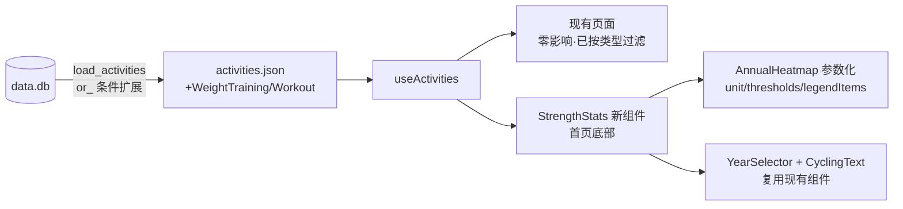

## 产品概述
在 running_page 首页底部新增一个“力量训练”统计模块，完整复用现有 "YEARLY HEATMAP" 跑步卡片的设计语言（暗黑卡片 + 渐变斜体标题 + 大数字统计 + 年度热力图 + 年份切换器），展示 WeightTraining 与 Workout 类型的训练数据。

## 核心功能
- **数据层**：扩展 Python 导出链路，将 WeightTraining（145 条）与 Workout（21 条）纳入 activities.json（当前因 `distance > 0.1` 过滤全部缺失）
- **年度热力图**：按日聚合的训练次数热力图，图例与 tooltip 语义为“次”而非"km"，主题色 violet/purple
- **统计指标**：当年训练次数（TOTAL SESSIONS）、总时长（TOTAL TIME）、总卡路里（TOTAL CALORIES）、平均心率（AVG HEART RATE）
- **年份切换**：复用 YearSelector，年份由力量训练数据生成（2026/2025/2024）
- **位置**：首页底部（ActivityStats 之后），不干扰现有跑步内容主次层级
- **兜底修复**：titleForRun 对非 Run/Hike/Walk 类型返回中性标题，避免污染时段统计
	


## 技术栈
复用现有项目栈：React 18 + TypeScript + Tailwind CSS（暗黑主题），SQLAlchemy + SQLite 数据导出，pnpm 构建。不引入新依赖。

## 实现方案

### 1. 数据层（run_page/apple_health_sync.py:199）
将 `filter(Activity.distance > 0.1)` 改为：
```python
from sqlalchemy import or_
query = session.query(Activity).filter(
    or_(Activity.distance > 0.1,
        Activity.type.in_(["WeightTraining", "Workout"]))
)
```
然后调用 `load_activities(session, False)` 重新导出 activities.json（预计 463 → 约 628 条），用 node 脚本验证 type 分布。
**影响面评估**：前端所有页面均已按类型过滤（首页 isRun、Hiking 页四类型、Tracks 页 tab 匹配），新增类型不影响现有展示；仅 `titleForRun` 兜底需同步修复（见第 3 点）。

### 2. AnnualHeatmap 参数化（src/components/AnnualHeatmap/index.tsx）
新增可选 props（默认值保持现有行为，跑步热力图零改动）：
- `unit?: string`（默认 `'km'`）— tooltip 单位
- `thresholds?: number[]`（默认 `[5, 10, 15, 20, 25]`）— 图例分档阈值
- `legendItems?: {label, title, colorClass}[]`（默认现有 km 图例）— 图例配置

力量训练传入：`unit="sessions"`、`thresholds=[1,2,3,4]`、图例 `'1'/'2'/'3'/'4'/'≥5'` 次。getLegendIndex 改为基于 thresholds 参数计算。

### 3. titleForRun 兜底（src/utils/utils.ts + const.ts）
非 Run/Hike/Walk 类型返回固定中性标题 `TRAINING_TITLE`（const.ts 新增：`IS_CHINESE ? '力量训练' : 'Strength Training'`），避免 WeightTraining/Workout 被标为“室内跑步”污染 useActivities 的 runPeriod 时段统计。

### 4. 新组件 StrengthStats（src/components/StrengthStats/index.tsx）
完全复刻 index.tsx:136-258 卡片结构：
- 卡片容器 + 顶部渐变（`from-violet-500/10 to-transparent`）
- 哑铃 SVG 图标 + "STRENGTH TRAINING" 渐变斜体标题（`from-violet-400 to-purple-500`）
- 统计组复用 CyclingText 大数字模式：TOTAL SESSIONS（次数）、TOTAL TIME（小时）、TOTAL CALORIES（kcal）、AVG HEART RATE（bpm）
- YearSelector 年份切换 + AnnualHeatmap（value=当日训练次数）
- 时长解析复用 `convertMovingTime2Sec`（moving_time 为 '1970-01-01 01:51:23' 格式，convertMovingTime2Sec 按 'HH:MM:SS' 拆分兼容此格式）

### 5. 首页集成（src/pages/index.tsx:261 之后）
在 ActivityStats 之后渲染 `<StrengthStats activities={activities} />`（useActivities 已返回全量 activities，组件内部过滤 WeightTraining/Workout）。

## 架构


## 性能与影响面
- 导出增量约 165 条无轨迹记录，JSON 体积增量小（无 streams/laps）
- StrengthStats 数据聚合 O(n)，n≈166，useMemo 缓存
- 爆炸半径控制：AnnualHeatmap 默认 props 保持向后兼容；跑步口径页面零改动
	

## 设计风格
完整继承现有 YEARLY HEATMAP 卡片设计，仅替换主题色为 violet/purple 力量训练色系。暗黑卡片（bg-card + border-gray-800/50 + rounded-card）、顶部微渐变光晕、哑铃图标 + 渐变斜体大写标题、font-condensed font-black 大数字统计、热力图格子渐入动画与图例交互（hover 高亮/点击隐藏分档），与页面其他模块视觉节奏完全一致。

## Agent Extensions
### Skill
- **verification-before-completion**
  - Purpose: 最终验证阶段强制先运行命令获取证据再声明完成
  - Expected outcome: lint 以 51 错误基线对比零新增、build exit 0，均附输出证据
- **agent-browser**
  - Purpose: 在 5173 端口 dev server 上自动化验证力量训练模块渲染、统计数字、热力图与年份切换，并截图确认视觉效果与现有页面无回归
  - Expected outcome: 首页底部出现 STRENGTH TRAINING 模块且数据正确，截图留证
