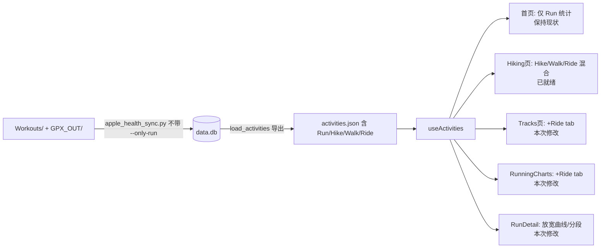

## 需求概述
让整个 running_page 项目完整支持 Hike/Walk/Ride 等非跑步类型数据的展示。当前 `src/static/activities.json` 中 376 条记录全部为 `type="Run"`（由 `apple_health_sync.py --only-run` 导入策略导致），且前端多处存在 Run-only 硬编码或类型 tab 缺失。

## 已确认的决策
1. **首页保持纯跑步统计**：`DashboardStats` 总距离/时长/PB 仍只算 Run，不改动（`src/pages/index.tsx:36` 的 isRun 入口过滤保留）。
2. **Hiking 页保持 Hike & Ride 范围**：Hike/Walk/Ride/VirtualRide 混合展示，现有代码已就绪，无需改动。
3. **Tracks 页增加骑行 tab**：TYPE_TABS 增加 Ride（匹配 RIDE/VIRTUAL_RIDE/EBIKE_RIDE 三种类型）。
4. **数据重导入纳入计划**：运行同步脚本（不带 `--only-run`）重新导入 Workouts 数据，使 Hike/Walk/Ride 入库并导出到 activities.json。

## 核心功能
- 数据层：重导入后 activities.json 包含 Hike/Walk/Ride 类型，Hiking 页直接可见数据
- Tracks 页：Run/Hike/Walk/Ride 四个类型 tab，URL 参数 `?type=ride` 可直达，年份联动正确
- RunningCharts：类型切换按钮增加 Ride，图表按类型正确过滤
- RunDetail：徒步/骑行活动详情页能正常显示心率/速度/海拔曲线和分段表
- 标题语义：`titleForRun` 对 Hike/Walk 输出"徒步/步行”相关标题而非“晨跑/夜跑”，时段统计不再混淆


## 技术方案
### 技术栈
复用现有项目栈：React 18 + TypeScript + Vite（hash router），Python 3.12 数据同步链路，pnpm 包管理。不引入任何新依赖。

### 实现策略
采用“最小改动、复用现有模式”的策略——项目展示层（ActivityIcon、MonthlyBarChart、ActivityCardList、CompactRunCalendar、hiking.tsx）已具备多类型支持，本次只需：

1. **数据层（零代码改动）**：`apple_health_sync.py` 默认即支持多类型导入/导出（`--only-run` 默认 False），仅需重跑同步命令并验证。
2. **标题语义修复**：`src/utils/utils.ts` 的 `titleForRun`（244-269 行）对 Hike/Walk 输出跑步标题（晨跑/夜跑等），新增 `isHike`/`isWalk` 助手函数并在 titleForRun 内按类型分流标题文案，同时修复 `useActivities.runPeriod` 统计混淆的隐患。
3. **Tracks 页 Ride tab**：`src/pages/Tracks.tsx` 的 TYPE_TABS（16-20 行）增加 Ride 项；URL 参数（23-49 行）支持 `type=ride`；过滤逻辑（62-66 行）从 `a.type === activeType` 精确匹配改为"Ride tab 匹配 RIDE/VIRTUAL_RIDE/EBIKE_RIDE 组"的组匹配（抽一个 `matchActivityType(type, tab)` 辅助函数，Run/Hike/Walk 仍精确匹配）。
4. **RunningCharts Ride 支持**：类型切换按钮（380-417 行）加 Ride，沿用现有 `selectedType` 过滤模式（318-332 行）；`ActivityTypeCard` 的 props 联合类型与 TYPE_CONFIG（28-54 行）扩展 Ride 配色。
5. **RunDetail 放宽**：心率/速度/海拔曲线（70 行）与分段表（81 行）的显示条件从 `isRun(run.type) && ...` 放宽为“有 streams/laps 即显示”；当月统计（34-40 行）保持 Run 口径不动。
6. **常量统一（次要）**：`CompactRunCalendar/index.tsx:104-119` 硬编码字符串改用 utils 常量，避免双源定义。

### 性能与影响面
- 所有改动均为 O(1) 或与现有过滤同复杂度的逻辑，无性能影响
- 首页、DashboardStats、maps.tsx 保持现状，控制爆炸半径
- 数据重导入使用 `--force` 忽略增量缓存，确保此前被 skipped_type 的文件补导

### 架构图


### 关键接口
```ts
// src/utils/utils.ts 新增助手（示意）
export const isHike = (type: string) => type === HIKE_TYPE;
export const isWalk = (type: string) => type === WALK_TYPE;
export const isRideLike = (type: string) =>
  type === RIDE_TYPE || type === VIRTUAL_RIDE_TYPE || type === EBIKE_RIDE_TYPE;
// Tracks 页 tab 与活动类型匹配：ride tab 匹配骑行组，其余精确匹配
export const matchActivityType = (activityType: string, tabType: string) => boolean;
```

### 目录结构
```
src/
├── utils/utils.ts                    # [MODIFY] 新增 isHike/isWalk/isRideLike/matchActivityType；titleForRun 按类型分流标题
├── pages/Tracks.tsx                  # [MODIFY] TYPE_TABS 加 Ride；URL 参数支持 type=ride；改用 matchActivityType 组匹配
├── pages/RunDetail.tsx               # [MODIFY] 70/81 行显示条件放宽为有 streams/laps 即显示
├── components/RunningCharts.tsx      # [MODIFY] 380-417 行类型按钮加 Ride；过滤沿用 selectedType
├── components/ActivityTypeCard/index.tsx  # [MODIFY] props 联合类型与 TYPE_CONFIG 扩展 Ride 配色
└── components/CompactRunCalendar/index.tsx # [MODIFY] 104-119 行硬编码字符串改用 utils 常量
run_page/                             # [无改动] 重跑同步脚本即可
```


## Agent Extensions
### Skill
- **verification-before-completion**
  - Purpose: 最终验证阶段，运行 pnpm lint、pnpm build 并在开发服务器上验证 Hiking/Tracks/RunDetail 页面数据展示，确认后再声明完成
  - Expected outcome: lint/build 通过且有证据输出，各页面行为符合预期
### SubAgent
- **code-explorer**
  - Purpose: 探索阶段已用于定位全部 Run-only 硬编码点与数据链路（已在本轮规划中完成）
  - Expected outcome: 已产出精确到行号的修改目标清单，作为 todolist 依据
